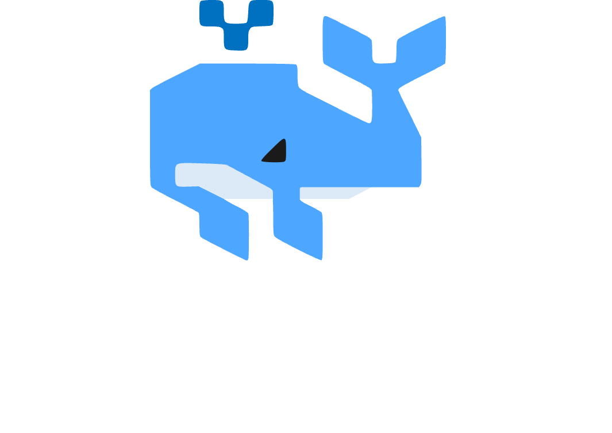

<p align="center">
  
</p>

<h1 align="center">K2 Network</h1>

<p align="center">
  Decentralized P2P marketplace powered by AI agents
</p>

<p align="center">
  <a href="https://github.com/yourusername/k2/actions"></a>
  
  <a href="LICENSE"></a>
</p>

---

## Features

- **AI-Powered Marketplace** - Intent classification via Tambo AI + Groq
- **P2P Communication** - Direct messaging over Iroh Gossip protocol
- **Contact Management** - P2P-synced contact book via iroh-docs
- **File Sharing** - Send and receive files directly via iroh-blobs
- **Topic-Based Discovery** - Join topics to find relevant buyers and sellers
- **Cross-Platform** - Windows, macOS, Linux, and Android
- **Folder Sync** - Syncthing-style sync powered by iroh-docs

## Quick Start

```bash
git clone https://github.com/yourusername/k2.git
cd k2-app-tauri
npm install
npm run tauri dev
```

For Android:

```bash
npm run tauri android dev
```

## Architecture

| Component | Description |
|-----------|-------------|
| [k2-core](k2-core/) | Rust P2P library (Iroh, gossip, blobs, docs) |
| [k2-app-tauri](k2-app-tauri/) | Tauri 2 + React 19 desktop and mobile frontend |

See [k2-docs/](k2-docs/) for detailed documentation.

## Tech Stack

| Layer | Technologies |
|-------|--------------|
| Frontend | React 19, TypeScript, Tailwind CSS, shadcn/ui |
| Desktop / Mobile | Tauri 2, Rust |
| P2P Network | Iroh (gossip, blobs, docs) |
| AI | Tambo AI, Groq |

## Configuration

Create `.env` in `k2-app-tauri/`:

```env
VITE_GROQ_API_KEY=your_groq_api_key
VITE_GROQ_BASE_URL=https://api.groq.com/openai/v1
VITE_GROQ_SMALL_MODEL=llama-3.3-70b-versatile
```

## Development

See [k2-docs/development.mdx](k2-docs/development.mdx) for the full development guide.

## License

[MIT](LICENSE)
