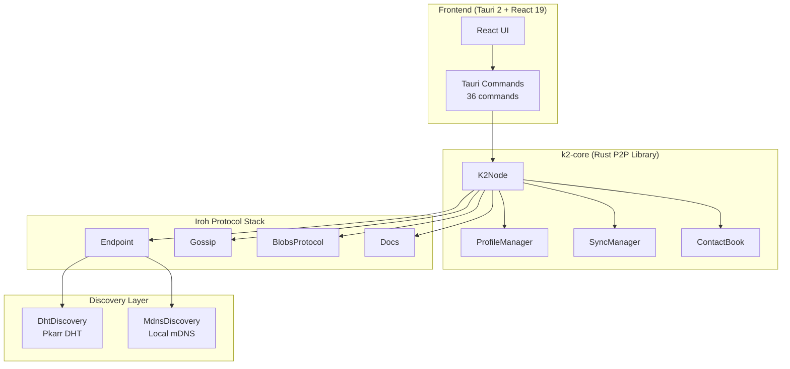
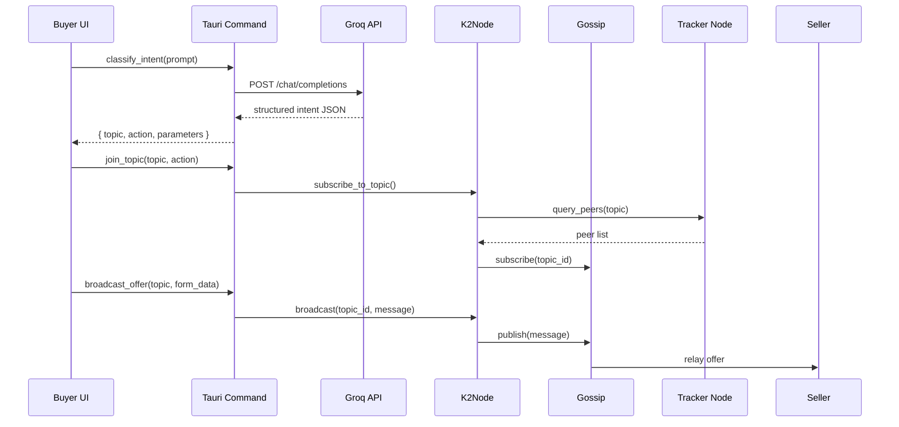
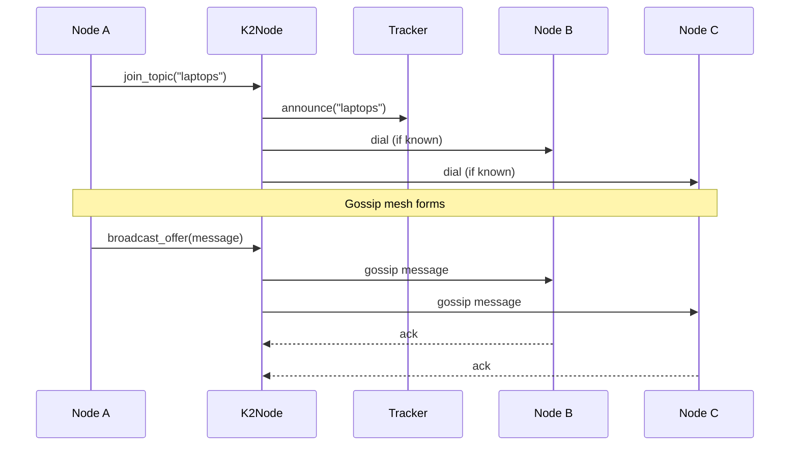
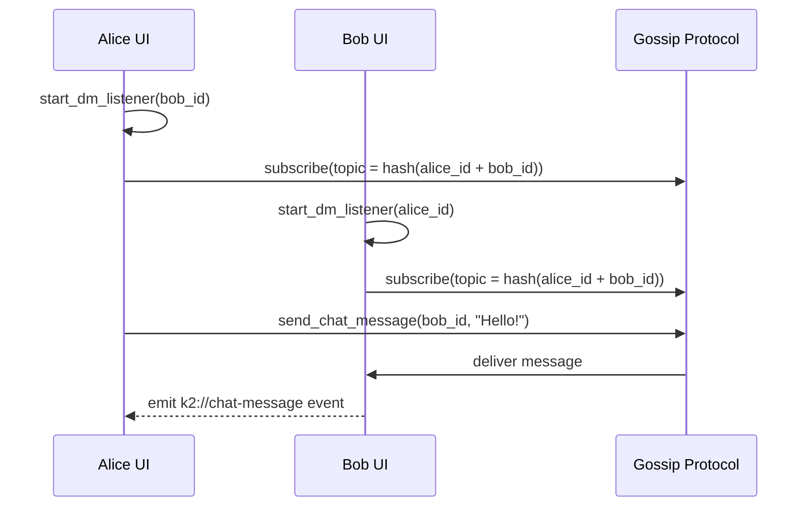
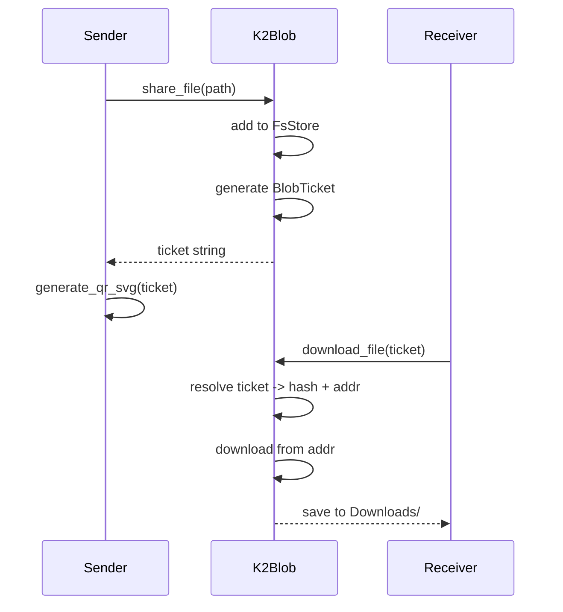

# Architecture

K2 Network is architected as a layered P2P system with a Rust core library and a Tauri-based frontend. This document describes the system components, data flows, and network architecture.

## System Overview



## Project Structure

### k2-core

The core Rust library wraps Iroh protocols and provides high-level APIs for marketplace, chat, file sharing, and synchronization.

| Module | File | Responsibility |
|--------|------|----------------|
| `K2Node` | `lib.rs` | Main node orchestrator. Manages Endpoint, Gossip, Blobs, Docs, and discovery |
| `Identity` | `identity.rs` | Secret key generation, OS secure store (Amulet), encrypted backup |
| `K2DocsClient` | `docs.rs` | Wrapper around iroh-docs for persistent document storage |
| `K2Blob` | `blobs.rs` | File sharing via iroh-blobs with ticket generation and download |
| `ProfileManager` | `profile.rs` | User profile storage and retrieval |
| `SyncManager` | `sync.rs` | Folder synchronization protocol over custom ALPN |

### k2-app-tauri

The frontend application exposes Rust functionality to the React UI via Tauri commands.

| File | Responsibility |
|------|----------------|
| `lib.rs` | 36 Tauri commands bridging UI to k2-core |
| `main.rs` | Application entry point |

## Data Flow Diagrams

### Marketplace Intent Flow

When a buyer submits an intent (e.g., "I want to buy a laptop under $1000"):



### P2P Broadcast Flow

Topic-based messaging uses Iroh Gossip with tracker-based peer discovery:



### Direct Message Flow

Direct messages between contacts use a topic derived from both node IDs:



### File Sharing Flow

Files are shared via iroh-blobs using tickets:



## Network Architecture

### Peer Discovery

K2 uses a multi-layered discovery strategy:

<AccordionGroup>
  <Accordion title="DHT Discovery (Global)">
    Uses Pkarr DHT for global peer discovery. Nodes announce their NodeId and network addresses to the distributed hash table, allowing peers anywhere on the internet to find each other.

    ```rust
    let dht = DhtDiscovery::new();
    let discovery = ConcurrentDiscovery::from_services(vec![dht, mdns]);
    ```
  </Accordion>

  <Accordion title="mDNS Discovery (Local)">
    Multicast DNS for discovering peers on the same local network. Ideal for LAN synchronization and reducing reliance on internet connectivity.

    Crate: `iroh-mdns-address-lookup` v0.1
  </Accordion>

  <Accordion title="Tracker-Based Discovery (Topic)">
    A default tracker node (`71853750efc1219d7976639087c5fb25cf8d4b49f6d509366f2e094a3f781623`) maintains peer lists per topic. When joining a topic, K2 queries the tracker for existing peers and announces its participation.
  </Accordion>
</AccordionGroup>

### Protocol ALPNs

K2 registers multiple application protocols on the Iroh Endpoint:

| ALPN | Protocol | Purpose |
|------|----------|---------|
| `iroh-blobs` | iroh-blobs | File storage and transfer |
| `iroh-gossip` | iroh-gossip | Topic-based pub/sub messaging |
| `iroh-docs` | iroh-docs | Persistent document synchronization |
| `k2/sync-invite/1` | Custom sync | Folder sync invitation protocol |
| `iroh-discovery` | Discovery | Peer address discovery |

### Topic System

Topics are the primary mechanism for organizing marketplace activity:

- **Topic ID**: `blake3::hash(topic_string)` - deterministic 32-byte identifier
- **Use Cases**: Product categories ("laptops", "services"), geographic regions, or custom tags
- **Messaging**: All topic participants receive broadcasts via Gossip
- **Discovery**: Tracker node helps new peers find existing topic members

## Technology Stack

### Rust Dependencies (k2-core)

| Crate | Version | Purpose |
|-------|---------|---------|
| `iroh` | 1.0.0 | Core P2P endpoint |
| `iroh-base` | 1.0.0 | Base types and utilities |
| `iroh-blobs` | 0.103 | File storage and sharing |
| `iroh-gossip` | 0.101 | Pub/sub messaging |
| `iroh-docs` | 0.101 | Document synchronization |
| `iroh-mainline-address-lookup` | 0.1 | DHT address resolution |
| `iroh-mdns-address-lookup` | 0.1 | mDNS local discovery |
| `tokio` | 1 | Async runtime |
| `serde` | 1 | Serialization |
| `blake3` | 1 | Cryptographic hashing |
| `aes-gcm` | 0.10 | Encryption (identity backup) |

### Frontend Dependencies (k2-app-tauri)

| Package | Version | Purpose |
|---------|---------|---------|
| `@tauri-apps/api` | ^2 | Tauri frontend API |
| `react` | ^19.2.3 | UI framework |
| `typescript` | ~5.6.2 | Type safety |
| `vite` | ^6.0.3 | Build tool |
| `@tambo-ai/react` | ^0.73.1 | AI intent integration |

## Data Persistence

All node data is stored locally on disk:

| Data Type | Location | Backend |
|-----------|----------|---------|
| Blobs | `AppData/k2/blobs/` | FsStore (iroh-blobs) |
| Documents | `AppData/k2/docs/` | redb (iroh-docs) |
| Identity | OS Secure Store + `identity.enc` | Amulet (Windows) / AES-GCM |
| Profile | iroh-docs namespace | Document sync |
| Contacts | iroh-docs namespace | Document sync |
| Sync Folders | iroh-docs namespace | Document sync |

Override the data directory with the `K2_DATA_DIR` environment variable for isolated or guest mode.

## Security Model

- **Identity**: Ed25519 secret keys. Primary storage in OS secure store (Windows via Amulet). Encrypted backup (`identity.enc`) with AES-GCM.
- **Transport**: TLS 1.3 with Ring cryptography (`tls-ring` feature)
- **Port Mapping**: UPnP/NAT-PMP support via `portmapper` feature
- **File Integrity**: BLAKE3 content-addressed storage ensures file integrity
